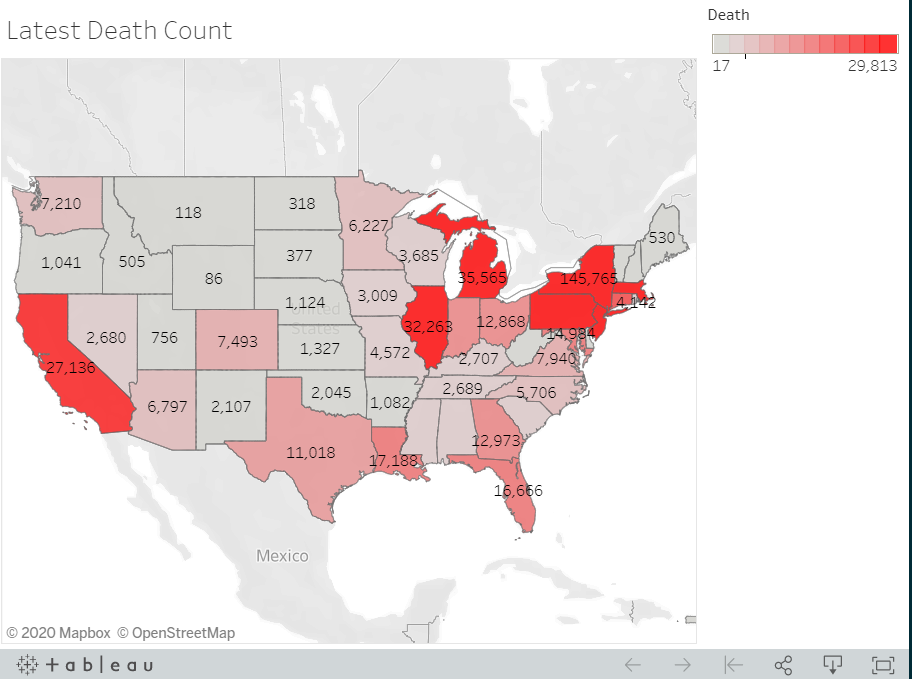

# 
Covid19 Reopening and Hotspots

## The goal was to look at how states reacted to the initial wave of COVID 19 and how those reactions impacted how their state is currently doing at controlling the spread. We want to study this because COVID 19 continues to effect our daily lives and is a hot topic around the world.  

## This repository is a subset of the original dealing with the Flask web site and its publication to heroku.

# The Initial Project - Data Gathering and 
The initial project dealt with using the COVID 19 data feed in conjunction with census data, and articles containing data that was web scraped.  A PostgreSQL database was created locally, and schema SQL script representing the database was executed against the local database.  The .csv files generated through the ETL process were manually imported.

## Issues
    * A local database was needed, and manual setup of the database was required
    * Running the database locally required entering in the for password for the local database.
    * Only by pulling the source code locally could it be configured to run

# A Heroku Django Application
The database was moved to be on a public AWS database instance which allowed access from any computer without database setup.  The Flask component of the application was converted to be a Heroku application.  The web site can be developed locally and pushed as needed.  A Django migration was created to handle the setup of the tables, and views.  The data is even loaded from the excel spreadsheets as part of the initial migration.  The application can be accessed here:

[link to Heroku!](https://fathomless-anchorage-55158.herokuapp.com/)